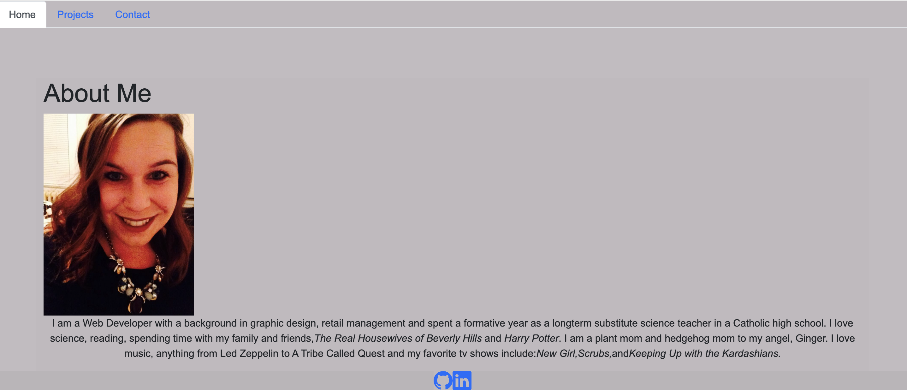

# react-portfolio

## Description

This portfolio was created to showcase what I've learned thus far with React to demonstate my ability to build single-page applications to potential future employers. 


## Table of Contents

- [Installation](#installation)
- [Usage](#usage)
- [Credits](#credits)
- [License](#license)

## Installation

<a href="https://katelynndonahue.github.io/react-portfolio/"><alt="Link to Portfolio">

## Usage

    ```md
    
    ```

## Credits

My instructor Leif Hetland and my tutor Faran Navazi.

## License

The last section of a high-quality README file is the license. This lets other developers know what they can and cannot do with your project. If you need help choosing a license, refer to [https://choosealicense.com/](https://choosealicense.com/).

---

🏆 The previous sections are the bare minimum, and your project will ultimately determine the content of this document. You might also want to consider adding the following sections.

## Badges

N/A

## Features

N/A

## How to Contribute

Please direct any suggestions for improvement to my <a href="https://github.com/katelynndonahue">GitHub</a> page. Thank you!

## Tests

N/A